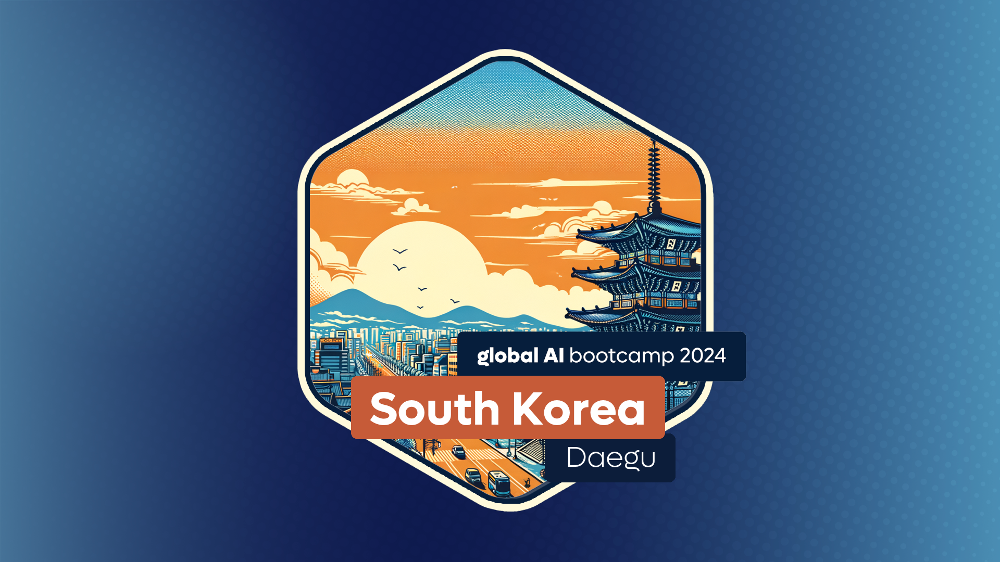
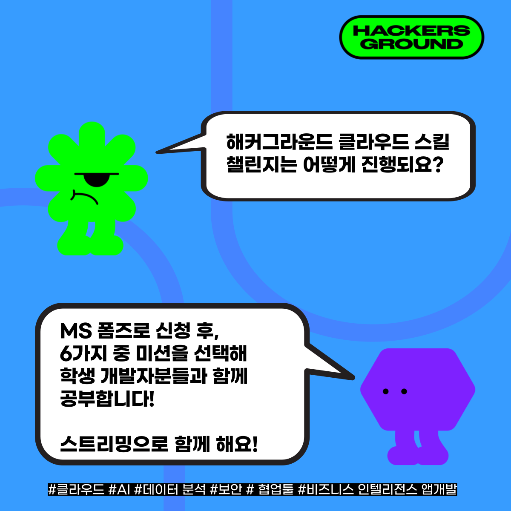

# 🙇‍♂️ 참가해주셔 감사합니다

글로벌 AI 부트캠프 2024 대구 행사에 참가하신 여러분께,

저희 글로벌 AI 부트캠프에 관심을 가져주셔서 감사합니다. 매년 3월 한 달 동안 전 세계에서 열리는 이 행사는 AI에 대한 열정을 가진 분들과 함께 AI와 관련한 핸즈온 워크샵을 진행하는 특별한 자리입니다.

이번 2024년 3월 23일에 대구에서 열린 행사에 참가해주셔 감사합니다. 내년에도 많은 관심 부탁드립니다.

* [공식홈페이지](https://globalai.community/bootcamp/south-korea-daegu/)

## 세션별 자료 정리

이번 행사에서 진행한 세선별 자료를 정리해 보내드립니다.

- 세션 1: [설문조사 수합을 한 큐에!]((https://github.com/pmj-chosim/Collect_Survey_Result))
- 세션 2: [누구나 쉽게 따라하는 AI 모델 생성](https://github.com/seoharuss/Azure_ML_Service_Designer)
- 세션 3: [DALL-E와 미드저니로 나만의 비주얼 세계 창조](https://github.com/dev-jiseok/CreateImages-AzureOpenAI?tab=readme-ov-file)

## MLSA 신청하기

이번 글로벌 AI 부트캠프는 MLSA 분들께서 기획하고 진행하셨습니다. 여러분도 신청하세요!  

나도 마이크로소프트 학생홍보대사 신청하기!  
* [마이크로소프트 학생홍보대사 신청링크](https://aka.ms/mlsakorea)
* [대경 클라우드 학생 개발자 오카방](https://aka.ms/student-developers/daegu) (비밀번호 8080)

## 클라우드 스킬 챌린지 신청하기

MLSA와 함께 온라인으로 공부할 수 있는 기회가 있습니다! 클라우드 스킬 챌린지에서 함께 하실 수 있습니다. 클라우드, AI, 데이터분석, 협업툴, 보안, 자동화+앱개발 등 다양한 주제를 함께 공부하실 수 있습니다.

시총 1등 기업이 알려주는 프로그래밍 스킬업 기회! 여러분들도 함께하세요.  

* [클라우드 스킬 챌린지 신청하기](https://aka.ms/hg/csc/register)
* [클스챌 스트리밍 플레이리스트](https://aka.ms/hg/csc/playlist)
* [해커그라운드 디스코드](https://aka.ms/hg/discord)

